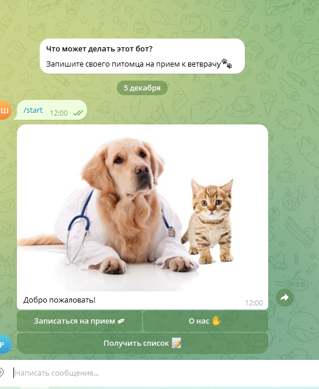
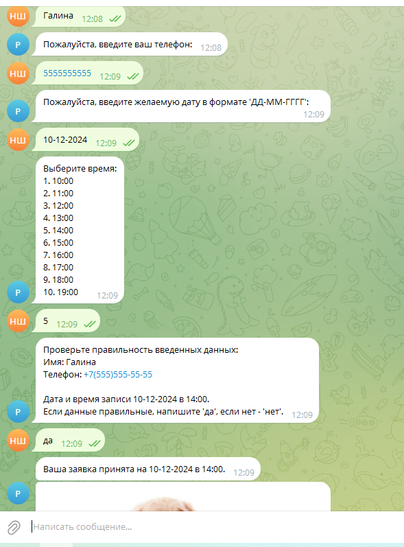
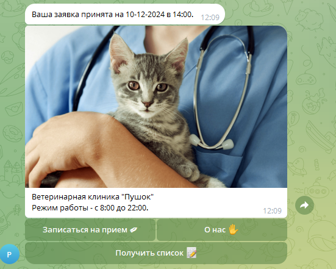
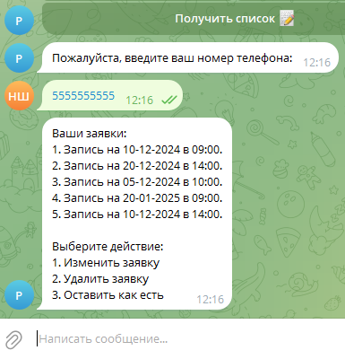
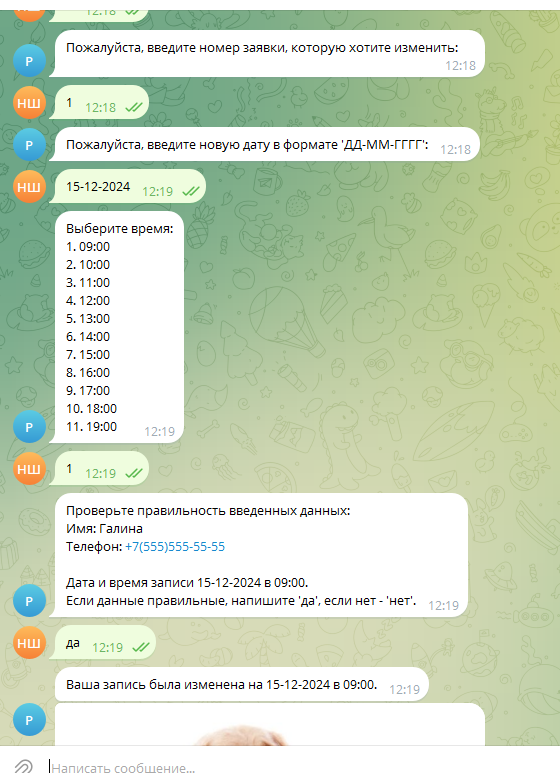
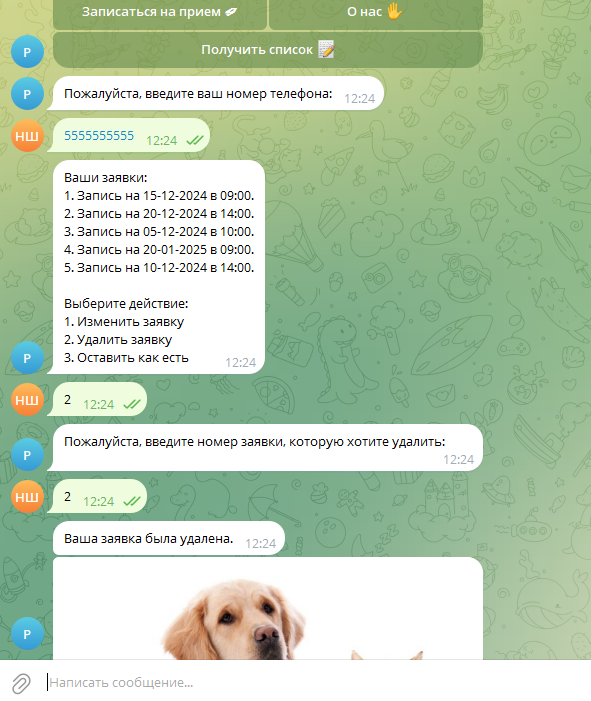
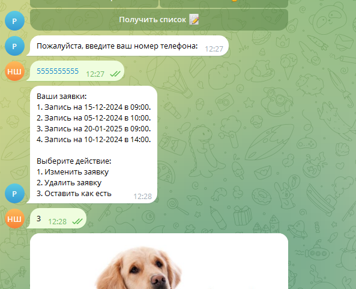
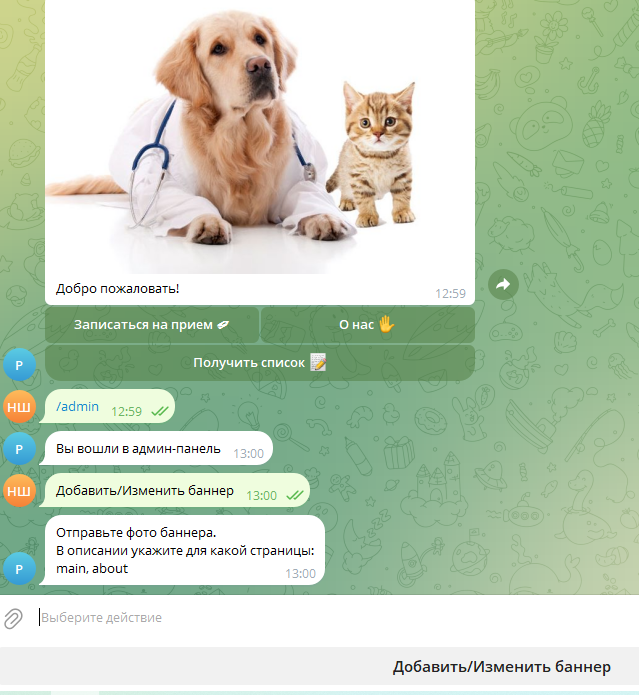

# Описание проекта

## Функциональные возможности бота

### Основные функции:
1. **Запись на прием:** Пользователи могут выбрать удобное время для записи к ветеринарному врачу.
2. **Просмотр заявок:** Бот позволяет пользователям просматривать свои активные заявки.
3. **Изменение записи:** Возможность корректировать время посещения.
4. **Удаление записи:** Функция удаления заявки, если необходимость в визите отпала.

### Дополнительные функции:
- **Валидация данных** при записи, чтобы избежать ошибок (например, проверка на пересечение записей).

---

## Меню пользователя
 
Реализованы инлайн-кнопки:
- **Запись на прием:** При нажатии на кнопку пользователь может зарегистрироваться на определенную дату и время приема. Для дальнейшей коммуникации ему будет предложено ввести имя и номер телефона. При выборе конкретной даты есть возможность забронировать место на удобное время. При этом время, на которое уже кто-то записался, для выбора недоступно.
   
- **О нас:** Просто информация о клинике.
   
- **Получить список:** Возможность увидеть все свои заявки (их может быть несколько на разные времена и даты), 
- -изменять время посещения или дату и, при необходимости, удалять их.
   
- - **"Изменить":** Меняем время и дату посещения.
   
- - **"Удалить":** Полностью удалить.
   
- - **"Оставить как есть":** Без изменений.
   
---

## Панель администратора

- **Вход** осуществляется через команду `/admin`. Чтобы добавить администратора, нужно добавить его в список (`id` администраторов).
   
---

## Архитектура и структура проекта

### Структура проекта:
1. **.venv:** Виртуальное окружение.
2. **Папка Common:**
   - `text_for.py` — файл, в котором хранится подписи и информация "о нас".
3. **Папка db:**
   - `engine.py` — для настройки и инициализации подключения к базе данных с использованием SQLAlchemy.
   - `models.py` — описание моделей для работы с базой данных в проекте с использованием SQLAlchemy.
   - `orm_query.py` — содержит настройки основных параметров соединения с базой данных.
4. **Папка handlers:**
   - `handlers_admin.py` — обработчики для взаимодействия администратора с ботом.
   - `handlers_user.py` — для обработки пользовательских запросов и доступ к функциям бота.
5. **Kbrd:** Папка с файлами настроек клавиатур.
6. **Logs:** Папка с файлами логов.
7. **Middlewares:**
   - Файл `db.py` содержит промежуточные слои (middlewares) для обработки запросов и взаимодействия между ботом и внешними ресурсами.
8. **.env:** Файл для хранения конфиденциальной информации, такой как токен бота и параметры подключения к базе данных.
9. **Logging_config:** Файл с настройками логирования.
10. **Main:** Главный файл проекта, отвечающий за запуск Telegram-бота.

---

## Логика работы бота

1. **Инициирование взаимодействия:** Пользователь отправляет сообщение или команду боту в Telegram.
2. **Обработка запросов:**
   - Обработчики команд направляют пользователя в соответствующий сценарий.
   - Обработчики данных обрабатывают ввод пользователя.
   - Валидация ввода перед сохранением заявки.
3. **Взаимодействие с базой данных:**
   - Запись, извлечение, обновление и удаление данных.
4. **Ответ пользователю:** Бот отправляет сообщение с результатом действия (создание, изменение или удаление записи).

---

## Используемые библиотеки и технологии

- **SQLAlchemy:** 2.0.36
- **aiofiles:** 24.1.0
- **aiogram:** 3.15.0
- **aiosqlite:** 0.20.0
- **magic-filter:** 1.0.12
- **python-dotenv:** 1.0.1
- **Asyncpg:** 0.29.0

Реализована возможность работы с базами данных как с SQLite, так и PostgreSQL.

---
